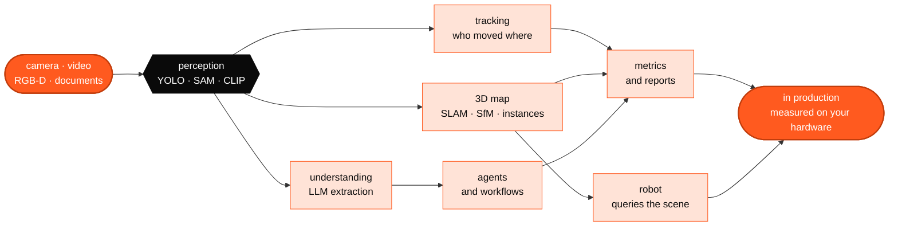
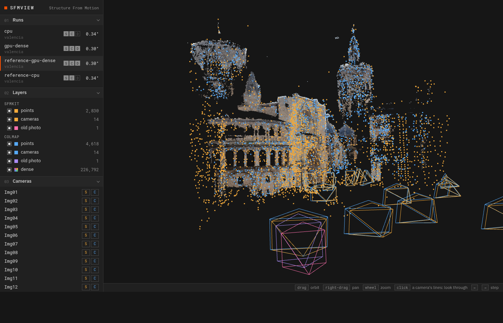
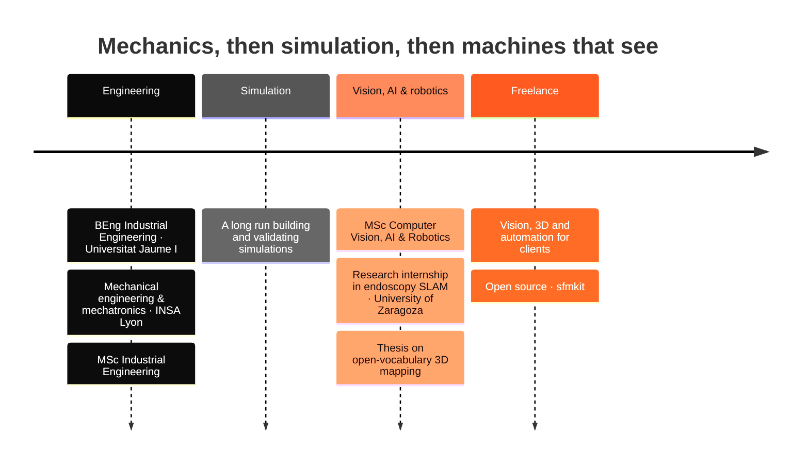

<div align="center">

<picture>
  <source media="(prefers-color-scheme: dark)" srcset="assets/hero-dark.svg">
  
</picture>

[](https://www.linkedin.com/in/david-padilla-orenga-7a232a134/)
[](https://github.com/dpadillaor/sfmkit)


&nbsp;

</div>

Engineer working where **computer vision, AI, robotics and automation** meet. I take systems that look great on a
benchmark and make them hold up in the real world: on a moving camera, in a hospital dataset, on a client's hardware,
inside a company's daily processes. Find what breaks, replace it with something better, measure it.

---

## 🧭 What I actually do

```
Computer vision  ──►  Detection, segmentation and multi-object tracking that survive *your* camera
3D & SLAM        ──►  Reconstruction, localization, place recognition, open-vocabulary 3D maps
Robotics         ──►  Perception a robot can use: persistent instances you can query in plain language
AI / ML          ──►  Datasets, training, fine-tuning and evaluation that is honest about failure cases
Automation       ──►  LLM agents and workflows for companies, with a human in the loop and a log of everything
```



---

## 🔭 Selected work

<table>
<tr>
<td width="52%" valign="top">
<a href="https://github.com/dpadillaor/sfmkit"></a>
</td>
<td width="48%" valign="top">

**[sfmkit](https://github.com/dpadillaor/sfmkit)** &nbsp;<sub>`OPEN SOURCE`</sub>

*Where was this century-old photograph taken from, and what has changed since?*

Structure from Motion written from the geometry up, with my own bundle adjustment. From **14 phone photos** of
Valencia's Plaza de la Virgen it rebuilds the square within **0.30° of COLMAP**, places an undated old photograph in the
model and flags what changed. Ships with a live 3D viewer.

`Python` `NumPy` `SuperPoint` `LightGlue` `COLMAP` `three.js`

[Code](https://github.com/dpadillaor/sfmkit) · [Docs](https://dpadillaor.github.io/sfmkit/)

</td>
</tr>
</table>

| Project | What I did | Stack |
|---|---|---|
| **3D instances that survive loop closure** <br><sub>MSc thesis · [OVO](https://github.com/dpadillaor/OVO)</sub> | Open-vocabulary online 3D mapping lost its object merges after loop closure. Traced it to stale geometry; added local bundle adjustment, a point-ownership conflict system that merges and splits instances from temporal evidence, and a better fusion step. | `CLIP` `SAM 2` `ORB-SLAM2` `Gaussian-SLAM` `Rerun` |
| **Learned place recognition for colonoscopy SLAM** <br><sub>Research internship · University of Zaragoza</sub> | Replaced Bag of Words in CudaSIFT-SLAM with ColonMapper, a learned global descriptor, ported to C++. Real time in loop closure and map merging; matches BoW and beats it on some sequences. | `C++` `LibTorch` `OpenCV` `C3VD` |
| **Scouting metrics from match video** <br><sub>Client · sports analytics</sub> | Football tracker that detects and follows players in match footage to extract scouting metrics. | `Detection` `MOT` `Video` |
| **Digitising an engineering firm** <br><sub>Client · automation</sub> | A database where there was none, automated processes and email, agents for repetitive work, a desktop app for energy-certification workflows and a Flutter app for on-site capture. | `Python` `Flutter` `LLM agents` `n8n` |
| **Water-meter digital twin** <br><sub>Public sector</sub> | Remote-reading platform for a town's LoRaWAN water meters: consumption, alarms and the state of every meter. | `TypeScript` `LoRaWAN` |
| [`catastro-scraper`](https://github.com/dpadillaor/catastro-scraper) | Retrieves PDF certificates and location maps from the Spanish Cadastre. | `Python` |
| [`Sem3_SI_ImageEmbedding`](https://github.com/dpadillaor/Sem3_SI_ImageEmbedding) | Seminar on CLIP-based image embeddings and retrieval. | `CLIP` `Jupyter` |

> 🔒 Most client work lives in private repos. Happy to walk through it on a call.

---

## 🎓 Path



🇪🇸 Spanish · 🇬🇧 English · 🇫🇷 French

---

## 🛠️ Toolbox

<div align="center">

**Languages**

[](https://skillicons.dev)

**Vision, AI & 3D**

[](https://skillicons.dev)

**Apps & infra**

[](https://skillicons.dev)

`CUDA` · `LibTorch` · `SAM 2/3` · `CLIP` · `SigLIP` · `YOLO` · `COLMAP` · `Gaussian Splatting` · `Rerun` · `n8n` · `Claude Code`

</div>

---

## 📊 Activity

<div align="center">


<picture>
  <source media="(prefers-color-scheme: dark)" srcset="https://raw.githubusercontent.com/dpadillaor/dpadillaor/output-3d/profile-3d-dark.svg">
  
</picture>

<picture>
  <source media="(prefers-color-scheme: dark)" srcset="https://raw.githubusercontent.com/dpadillaor/dpadillaor/output/snake-dark.svg">
  
</picture>

</div>

---

## 🤝 Let's talk

A camera that should be counting something, a robot that needs to understand its surroundings, a 3D capture to turn
into something useful, or a company drowning in manual work between its tools: that is my favourite kind of conversation.
**First I tell you whether it's viable. Then I build it.**

<div align="center">

[](https://www.linkedin.com/in/david-padilla-orenga-7a232a134/)
[](https://github.com/dpadillaor/sfmkit)

</div>
