<picture>
  <source media="(prefers-color-scheme: dark)" srcset="assets/header-dark.svg">
  
</picture>

<picture>
  <source media="(prefers-color-scheme: dark)" srcset="assets/ribbon-dark.svg">
  
</picture>

 

I'm **David**, a freelance engineer working across **computer vision, AI, robotics and automation**. Industrial and mechatronics engineer by training, with a master's in **computer vision, AI & robotics** and a long background in simulation before that. One idea runs through everything I build: **it has to work in real conditions, not just on the benchmark.**

From a 3D map that a robot can query in plain language to the agent that sorts a company's email, the job is the same: find what breaks outside the lab, replace it with something better, and measure it.

 

## `01` &nbsp;What I do

<table>
<tr>
<td width="50%" valign="top">

**`VIDEO` &nbsp;Detection & tracking** 
Counting, inspecting or following things when off-the-shelf models fail on *your* camera. Fine-tuned to your data, measured on your hardware.

</td>
<td width="50%" valign="top">

**`ROBOTICS` &nbsp;Semantic 3D understanding** 
Persistent object instances and open vocabulary: ask the map in natural language, no retraining.

</td>
</tr>
<tr>
<td valign="top">

**`SLAM` &nbsp;Robust localization** 
Low texture, reflections, abrupt motion. I swap the module that fails and benchmark it against the original.

</td>
<td valign="top">

**`CAPTURE` &nbsp;3D reconstruction** 
Point cloud, mesh or Gaussian splat, with calibrated cameras and a viewer to show it — from capture onwards.

</td>
</tr>
<tr>
<td valign="top">

**`MODELS` &nbsp;Custom machine learning** 
When no catalogue model answers your question: dataset, training or fine-tuning, and an honest evaluation.

</td>
<td valign="top">

**`PROCESS` &nbsp;AI automation for companies** 
Reading documents, triaging email, moving data. Workflows and LLM agents with a human in the loop and a log of what they did.

</td>
</tr>
<tr>
<td colspan="2" valign="top">

**`ASSETS` &nbsp;Digital twins** — every asset, where it is and what it reports, kept up to date with real data instead of scattered spreadsheets.

</td>
</tr>
</table>

 

## `02` &nbsp;Selected work

<table>
<tr>
<td width="55%" valign="top">

</td>
<td width="45%" valign="top">

`OPEN SOURCE` · `STRUCTURE FROM MOTION`

### [sfmkit](https://github.com/dpadillaor/sfmkit)

Structure from Motion written from the geometry up: matching, incremental reconstruction and my own bundle adjustment. From **14 phone photos** of Valencia's Plaza de la Virgen it rebuilds the square within **0.30° of COLMAP**, locates an undated century-old photograph in the model and flags what has changed since.

`Python` `NumPy` `SuperPoint` `LightGlue` `COLMAP` `three.js` `Docker`

[Code](https://github.com/dpadillaor/sfmkit) · [Docs](https://dpadillaor.github.io/sfmkit/)

</td>
</tr>
</table>

<table>
<tr>
<td width="50%" valign="top">

`MSC THESIS` · `OPEN-VOCABULARY 3D`

#### 3D instances that survive loop closure

[OVO](https://github.com/dpadillaor/OVO) builds, while the camera moves, a 3D map where every object is an instance you can query with text. After a loop closure, instances stopped merging correctly. I traced it to stale geometry and fixed it with **local bundle adjustment**, a **point-ownership conflict system** that merges and splits instances from accumulated temporal evidence, and an improved fusion step.

`CLIP` `SAM 2` `ORB-SLAM2` `Gaussian-SLAM` `Rerun`

</td>
<td width="50%" valign="top">

`RESEARCH INTERNSHIP` · `UNIVERSITY OF ZARAGOZA`

#### Learned place recognition in colonoscopy SLAM

In CudaSIFT-SLAM, a SLAM system for colonoscopy, I replaced Bag-of-Words place recognition with **ColonMapper**, a learned global descriptor. Ported to C++, it runs in **real time** for loop closure and map merging, matches Bag of Words and beats it on some sequences.

`C++` `LibTorch` `TorchScript` `OpenCV` `C3VD`

</td>
</tr>
<tr>
<td valign="top">

`CLIENT` · `SPORTS ANALYTICS`

#### Scouting metrics from match video

A football tracker that detects and follows players in broadcast footage to extract metrics useful for scouting.

`Detection` `Multi-object tracking` `Video`

</td>
<td valign="top">

`CLIENT` · `AUTOMATION`

#### Digitising an engineering firm, process by process

A database where there was none, manual processes automated, email handled, and agents for the repetitive work — plus a desktop app for energy-certification workflows and a Flutter app for on-site data capture.

`Python` `Flutter` `LLM agents` `n8n` `Notion API`

</td>
</tr>
<tr>
<td valign="top">

`PUBLIC SECTOR` · `DIGITAL TWIN`

#### Water-meter network for a municipality

Web platform for remote reading of a town's LoRaWAN water meters: consumption, alarms and the state of every meter in one place.

`TypeScript` `LoRaWAN` `Data pipelines`

</td>
<td valign="top">

`TOOLS`

#### Smaller things

- [**catastro-scraper**](https://github.com/dpadillaor/catastro-scraper) — retrieves PDF certificates and location maps from the Spanish Cadastre.
- [**Image embeddings with CLIP**](https://github.com/dpadillaor/Sem3_SI_ImageEmbedding) — seminar notebooks on CLIP-based retrieval.

</td>
</tr>
</table>

 

## `03` &nbsp;Toolbox

| Area | Tools |
|---|---|
| **Vision & 3D** | `YOLO` `SAM 2 / SAM 3` `CLIP` `SigLIP` `Perception Encoder` `OpenCV` `SuperPoint` `LightGlue` `COLMAP` `Gaussian Splatting` |
| **SLAM & geometry** | `ORB-SLAM2` `Gaussian-SLAM` `Bundle Adjustment` `Loop Closure` `Place recognition` `Structure from Motion` |
| **Machine learning** | `PyTorch` `LibTorch` `TorchScript` `CUDA` `NumPy` `Jupyter` |
| **Automation & AI agents** | `LLM agents` `Claude Code` `n8n` `Notion API` `Streamlit` |
| **Languages** | `Python` `C++` `Rust` `TypeScript` `Dart` |
| **Product & infra** | `Flutter` `Astro` `three.js` `Docker` `Redis` `SQLAlchemy` `Git` |
| **Visualisation** | `Rerun` `three.js` `PyVista` `Manim` |

  
  
  
  
  
  
  
  
  
  
  

 

## `04` &nbsp;How I work

> **First I tell you whether it's viable. Then I build it.**

| # | Step | Terms |
|:-:|---|---|
| `1` | **20-minute call** — you tell me the problem; I tell you whether vision or AI is the right path, or if something cheaper will do. | free |
| `2` | **Feasibility test** — a scoped prototype on your real data, with numbers and a clear report of what works. | fixed scope & price |
| `3` | **Development** — the full system, measured on your hardware, with short demos every week. | weekly deliveries |
| `4` | **Handover** — code, documentation, a video of how it works and a session so your team can maintain it. | yours, no lock-in |

 

## `05` &nbsp;Background

- **MSc in Computer Vision, Artificial Intelligence & Robotics**
- **MSc in Industrial Engineering**
- **BEng in Industrial Engineering** — Universitat Jaume I, Castellón
- **Mechanical engineering & mechatronics** — INSA Lyon
- **Research internship** in SLAM for endoscopy — University of Zaragoza
- 🇪🇸 Spanish · 🇬🇧 English · 🇫🇷 French

 

## `06` &nbsp;Let's talk

Got a vision, 3D, robotics or automation problem? Tell me about it — I'll say whether I can help, and if not, who can.

 

<code>VALENCIA · REMOTE</code> &nbsp;·&nbsp; assets generated by <a href="scripts/build_assets.py"><code>scripts/build_assets.py</code></a>

